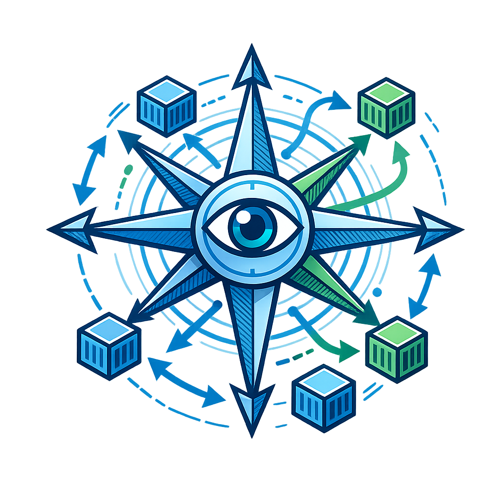
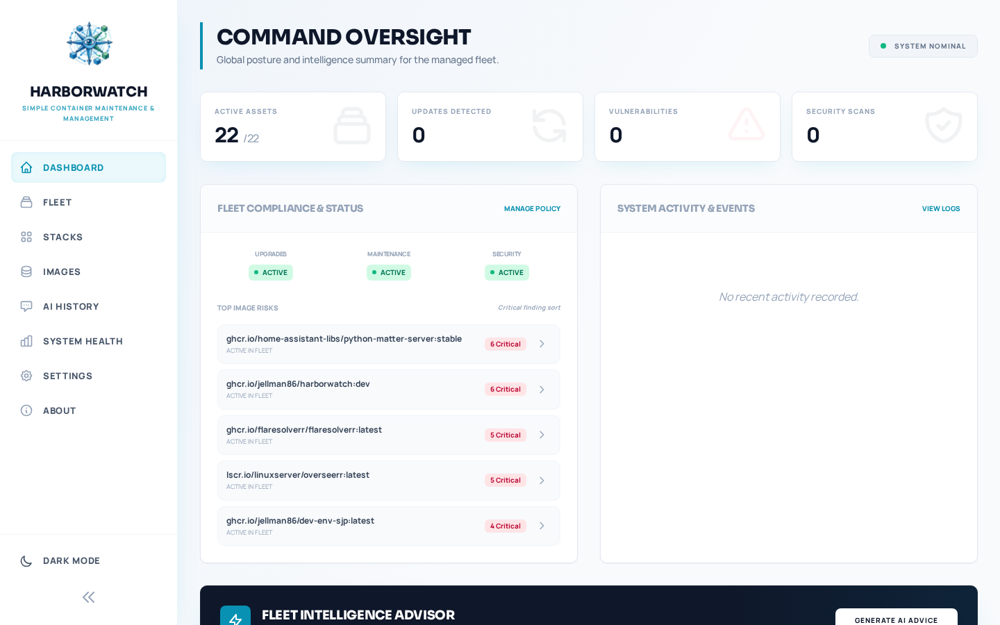

# <p align="center">HarborWatch</p>

<p align="center">
  
</p>

<p align="center">
  <strong>Your friendly, all-in-one Docker fleet companion.</strong><br />
  Automated maintenance, smart lifecycle management, and built-in security—all from a single, lightweight container.
</p>

---

## 👋 What is HarborWatch?

I built HarborWatch because I wanted a simpler way to look after my home server. I had too many containers to check for updates manually, and I wanted to know if my media folders were safe without running complex enterprise tools.

HarborWatch is a local-first appliance that transforms passive monitoring into active management. It’s built to be charming, fast, and easy to use.

---

## ✨ Key Highlights

| | |
| :--- | :--- |
| **📊 Fleet Command** | Real-time metrics, logs, and disk usage for every container. Spot runaway apps before they eat your CPU. |
| **🚀 Lifecycle Pilot** | Automated update detection and application. It can even read changelogs using AI to warn you about breaking changes. |
| **🛡️ Security Hub** | Built-in vulnerability (Trivy) and malware (ClamAV) scanning. It watches your host mounts so you don't have to. |
| **❤️ Self-Healing** | Automatically restarts containers that fall into an `unhealthy` state, with smart cooldowns to prevent loops. |
| **🧹 Auto-Housekeeping** | Keeps your host clean by pruning old images and maintaining a tidy database automatically. |
| **🤖 AI Integration** | Optional support for OpenAI, Anthropic, or Gemini to audit your configs and summarize release risks. |

<p align="center">
  
</p>

---

## 🚀 Quick Start

HarborWatch is a single monolithic container. No complex sidecars or external databases required.

```yaml
services:
  harborwatch:
    image: jellman86/harborwatch:latest
    container_name: harborwatch
    volumes:
      - /var/run/docker.sock:/var/run/docker.sock
      - ./data:/data
    ports:
      - 8080:8080
    restart: unless-stopped
```

1.  Copy the snippet above into a `docker-compose.yml`.
2.  Run `docker-compose up -d`.
3.  Open your browser to `http://localhost:8080`.

---

## 📖 Deep Dives

I've written some detailed guides if you want to get into the nitty-gritty:

*   [📊 Detailed Feature List](docs/FEATURES.md) - Everything HarborWatch can do.
*   [🤖 AI Copilot Guide](docs/AI_GUIDE.md) - How to use LLMs to help manage your server.
*   [⚙️ Automation & Self-Healing](docs/AUTOMATION.md) - How the "magic" happens behind the scenes.
*   [🔗 Integrations](docs/INTEGRATIONS.md) - Connecting Portainer and Discord.
*   [🛠️ Setup & Configuration](docs/CONFIGURATION.md) - Advanced environment variables and volume mapping.

---

## 🛠️ Technology Stack

*   **Backend**: Go 1.26 (Fast, small, and reliable).
*   **Frontend**: Svelte 5 + Tailwind CSS (A snappy, modern UI).
*   **Database**: SQLite (Embedded—no setup required).
*   **Engines**: Docker SDK, Trivy, and ClamAV.

---

## 🤝 Feedback

If you find a bug or have an idea, feel free to open an issue!
